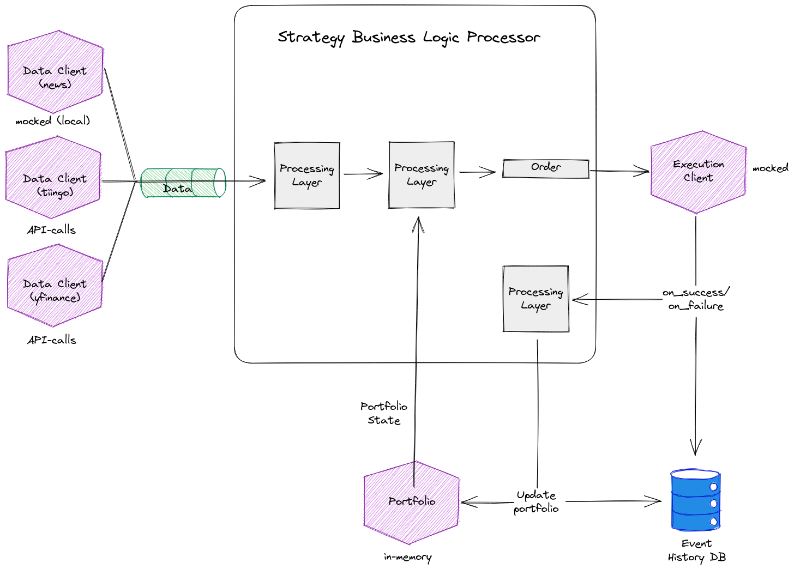

# [Orbital] Doofin

Doofin is a project aimed at building an extensible, easy-to-use trading system to deploy your strategies. While we do not yet have a functioning product, we have mapped out our product development plan in detail. You can find this in the `docs` directory.

Refer to the [Product Requirements Document](docs/product_requirements/README.md) and the rest of the `docs` for a comprehensive overview.

## Setup

To get Doofin up and running, please follow these steps:

1. Ensure you have Python 3.8 installed on your machine. If you don't have it, you can download it from the official Python website.

1. Clone this repository to your local machine.

1. Set up a python virtual environment.
   ```shell
   python3.8 -m venv venv
   python3 -m venv venv # depends on machine
   python -m venv venv # depends on machine
   ```

1. Activate the virtual environment

    - **Linux/macOS**:

      ```shell
      source venv/bin/activate
      ```

    - **Windows (Command Prompt)**:

      ```shell
      venv\Scripts\activate.bat
      ```

    - **Windows (PowerShell)**:

      ```shell
      .\venv\Scripts\Activate.ps1
      ```

1. Install the required packages.

   ```shell
   python3 -m pip install -r requirements.txt
   ```

## Quick Start Guide

For a practical demonstration, refer to the `demo.ipynb` notebook in the main directory of this project. You can view this file directly on GitHub by navigating to this [link](https://github.com/minreiseah/orbital/blob/main/demo.ipynb).

## High-Level Architecture

Here is our initial projected architecture for the first milestone:



Despite our best efforts, we encountered several technical challenges during the implementation phase that led to adjustments in our target. These primarily centered around a difficulty in orchestrating the components together.

This is a normal part of the development process, and we believe that these experiences will better equip us to anticipate and manage potential issues in the future.

For more details on the product's architecture and design decisions, please refer to the PRDs and technical designs in the `docs` directory.

## Tech Stack

### Languages & Key Libraries

- Python: The top layer exposed to clients.
- Rust: Not yet implemented but will.

Additional libraries and tools used in the project will be updated as the project progresses.

For a more detailed breakdown of our tech stack, please refer to `docs/tech_stack.md`.
