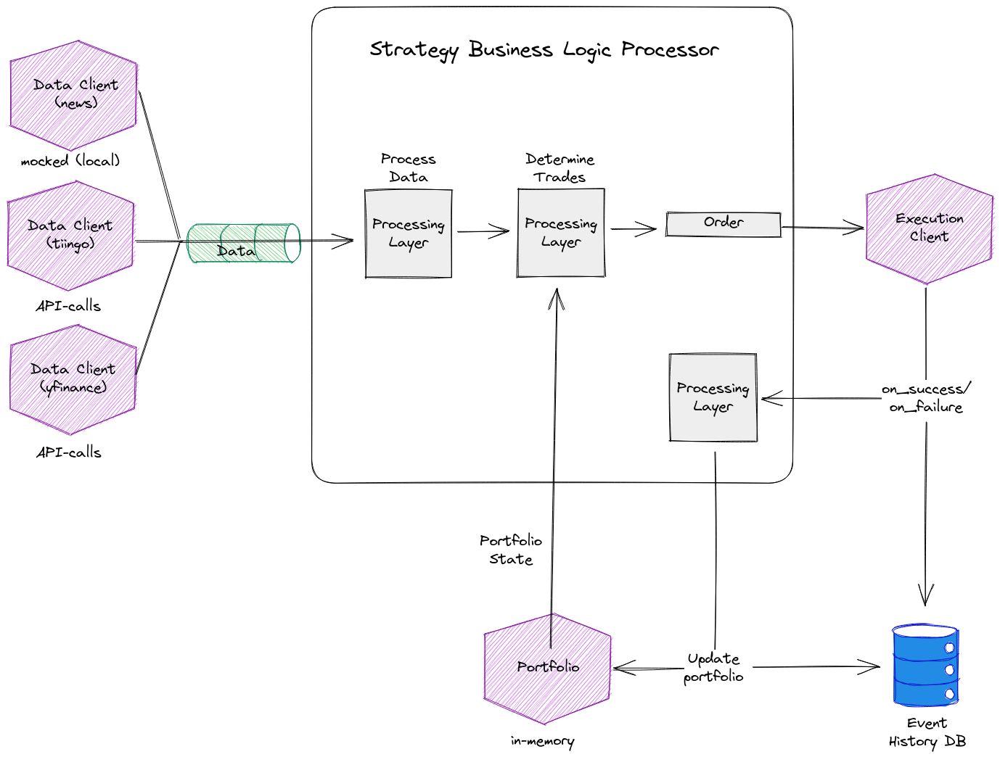
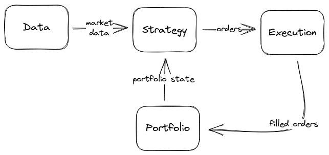
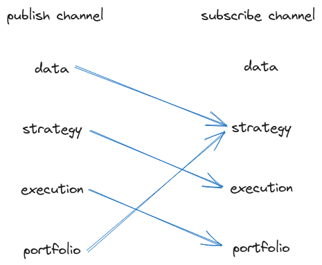
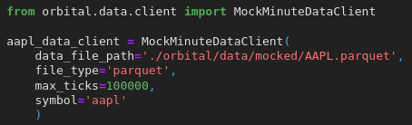
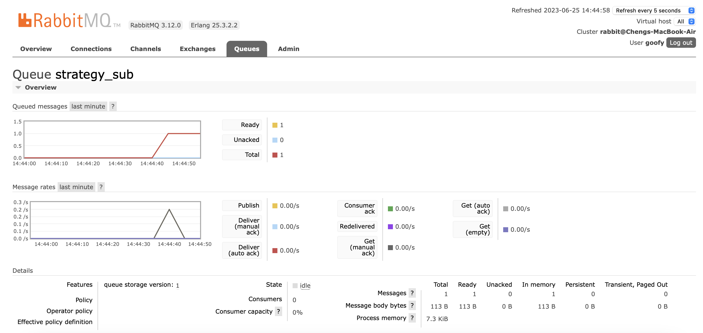
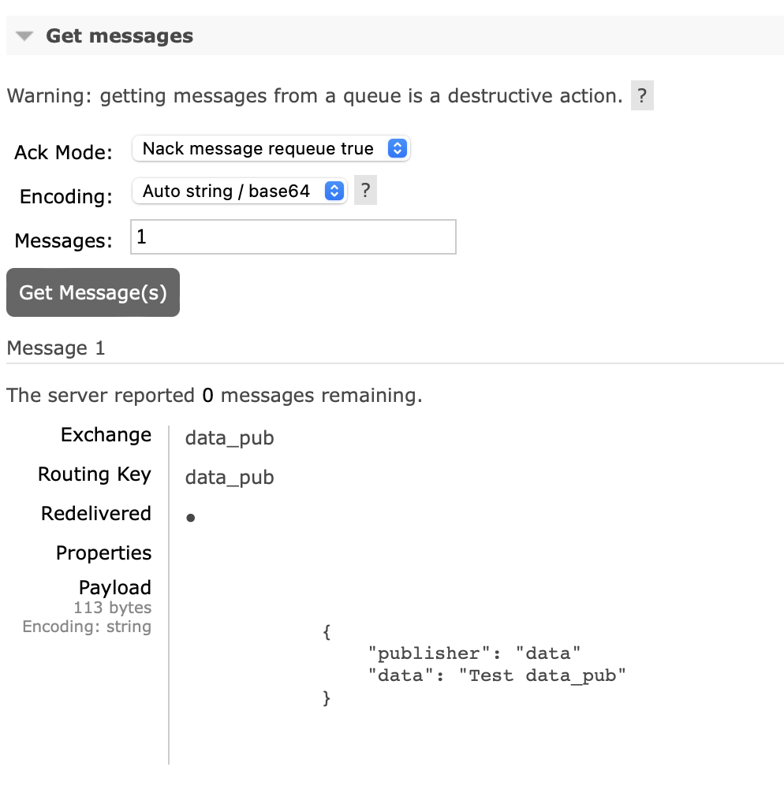
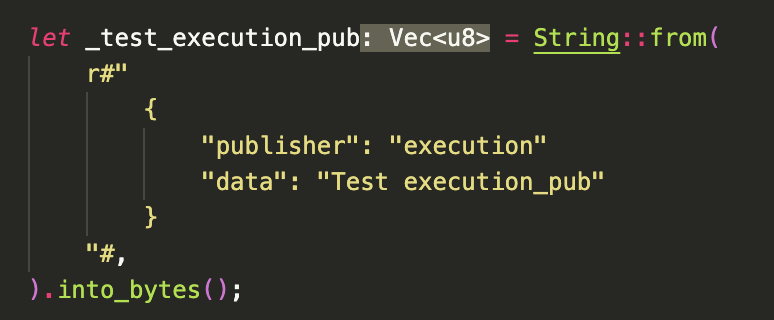
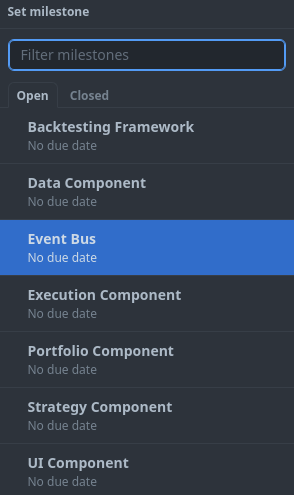
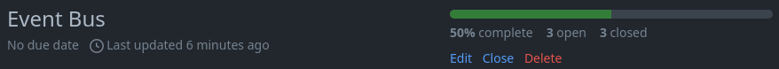
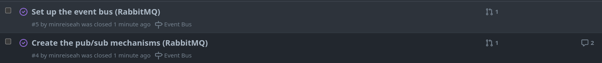

# [Orbital] Doofin

## Overview

Doofin is an extensible, easy-to-use trading system to deploy your strategies.

### Rationale

> Most undergraduate research on asset trading strategies are rarely deployed to live production because most open source trading system software have too much vendor lock-in. For instance, quantconnect requires users to use their proprietary platform and language to deploy trades. Furthermore, users may be uncomfortable with sharing their strategies since the backend logic runs on foreign servers. Lastly, most open source systems are not extensible enough. Therefore, our project aims to build an extensible, easy-to-use trading system to deploy these strategies.

### Key Features

1. Traders can execute trading strategies

2. Researchers can backtest trading strategies

3. Backtester can playback historical data and simulate data

4. Data platform that allows for uploading and extracting data

We define success in the following manner:
1. The platform *must be* performant (low latency) and reliable (high availability)
2. The platform *should be* flexible (support as many flows as possible)
3. The platform *does not need to be* scalable (handle high traffic)


## High-Level Architecture




Figure: Architectural Overview of Running System

The system is broken down into four components, each embodying a feature: Strategy, Portfolio, Data, Execution. These components are glued together by our Message Broker (RabbitMQ). These components work together to facilitate _modularity_ and _loose coupling_.



Figure: Message Flow Between Components



Figure: Publish/Subscription Channels 

Through our pub/sub architecture, each component is not directly aware of other components. Their only form of contact is through messages.

## User Flow

> This is the expected user flow to get one’s automated trading system up and running. More details for each part of the flow are found under the **Features **section. Do refer to our [demo](https://github.com/minreiseah/orbital/blob/main/demo.ipynb) for a more thorough runthrough.

1. **Initialising data component**
    - Integration with data clients (external)
    - Integration with data clients (internal)

The user *must* define the data clients they want to interact with. At minimum, _one_ data client has to be defined such as real-time market data streamed from [Interactive Brokers](https://www.interactivebrokers.com/en/home.php). For users’ convenience, this data stream will be predefined in the system and ready-to-use. This data client is used to guide their strategy on how to place orders.

2. **Initialising execution component**
    - Integration with execution clients (external)

The user *may* decide to define the execution clients they want to interact with. By default, orders will be routed through Interactive Brokers.

3. **Initialising portfolio**
    - Integrate with one strategy
    - Integrate with other strategies

The user *may* set up a fresh portfolio for their strategy or connect their strategy to a pre-existing portfolio. The portfolio component allows the strategy to view:
    - Open positions
    - Open orders
    - Closed orders
    - Historical positions
    - Historical orders

4. **Initialising strategy component**
    - Integration with data component
    - Integration with execution component
    - Integration with portfolio component

The user *must* define a strategy to make decisions based on the **data** and **portfolio** components, and place trades via the **execution** component. How the trade decisions are made are at the discretion of the user.

## Features

### Feature 1: Strategy

The strategy component is the heart of our trading system, allowing the user to define and execute their own customised strategies. In developing the strategy component, we aim to provide the user with a toolkit in order to create and define their own strategies, including dynamic strategies that update based on live market and portfolio data.

#### User Stories

1. As a trader, I want the ability to define my own markers and parameters for a trading algorithm, writing my own unique trading strategies.
2. As a trader, I want my trading algorithm to be dynamic and able to react to live market and portfolio data.

To fulfil these two user stories, our strategy component needs the following functionalities:
    - Data handler to handle incoming data
    - Allow users to define rules and make decisions based on incoming market data
    - Place orders via the execution component

#### Feature Design

The strategy component will be linked to one thing: the message broker.

Through the message broker, the strategy component will receive data from the data component, such as live market data.

Through the message broker, the strategy component will also receive portfolio updates from the portfolio component, such as the current state of the portfolio.

The strategy components will also replay order updates to the execution component through the message broker such as the placing, cancelling, or adjusting of orders.

#### Feature Benefits

1. The trading system can perform automated trades, according to a set of rules defined by the user.

#### Feature Testing

The strategy component will be difficult to test, due to its many moving parts. Therefore, we have decided that the easiest way to test the system will be to increase the visibility of the system as much as possible, through the addition of both a system log and getter methods. When coupled together with a custom set of input data, this will allow the user to observe the flow of data through the strategy component, and check whether the system is being executed according to their desired strategy.

However, it is important that the user must write their own unit tests for the strategies they implement. There are a tremendous number of possible trading algorithms; combined with the fact that users are allowed to customise and define their strategies, it is simply not possible for us to have in-built tests for all user strategies.

### Feature 2: Portfolio

While portfolio data could be seen as just another data stream, the idea is that decisions should be made around the state of the portfolio. As such, more specific interfaces would be useful to more effectively capture the state of the portfolio or even actively identify the "bad" state of a portfolio.

#### User Stories

1. As a trader, I want to integrate a single portfolio from my brokerage
2. As a researcher, I want to create virtual portfolios to allow for scenario testing
3. As a user, I want to be able to view the current state of my portfolio

To fulfil these three user stories, our strategy component needs the following functionalities:
    - Querying portfolio data
    - Integrating portfolios from brokerage sources (e.g. Interactive Brokers)
    - Support creating virtual portfolios

#### Feature Design

The portfolio component will be linked to one thing: the message broker.

Through the message broker, the portfolio component will receive data from the execution component, such as order fulfilments.

The portfolio component will also relay portfolio state updates to the strategy component through the message broker.

#### Feature Benefits

1. The portfolio component allows the strategy component to make decisions based on portfolio state
2. The portfolio provides a real-time overview of portfolio state through a graphical user interface

#### Feature Testing

We will test the portfolio component in the following ways:

1. Receiving and sending messages from the message broker properly. This involves the unit tests:
    - Mocking portfolio state and passing it to the strategy component via the message broker
    - Mocking order fulfilment messages from the execution component and relaying them to the portfolio component via the message broker
    - Mocking true portfolio state from the execution component and relaying it to the portfolio component via the message broker
2. Consumption of events from message broker that correctly updates portfolio state

### Feature 3: Data

The data component of the trading system is an extensible system that by default transmits live market data to the strategy execution component, and also allows for users to add their own sources of data.

#### User Stories

1. As a trader, I want to implement dynamic trading strategies that can react to market data.
2. As a rich and successful trader, I want to integrate my own sources of data that are not publicly available, allowing for further fine tuning of my trading strategy.
3. As a researcher, I want to run my trading strategy on my own specific training data sets, such as historical data.

To fulfil these three user stories, our data receiver needs the following functionalities:
    - Communication with IBKR through either the TWS API or IB Gateway.
    - Message parser and formatter to convert data from IBKR format to the trading system’s internal format.

#### Feature Design

To implement the above functionalities, we first use the `twsapi` crate to create a client and a wrapper that can send and receive messages through the TWS API. By default, the live data collection feature will only collect price and order book data. However, we aim to make the system extensible and allow the user to collect other types of data, such as information about options and contracts. This data is then converted through a message parser and formatter, before being passed to the message broker for receipt by other components of the system.



Figure: Mocked Data Client

If users wish to add their own data streams, they are currently able to implement time-series market data streams with `parquet` files that minimally follow the open-high-low-close configuration such as in our [mocked AAPL data](https://github.com/minreiseah/orbital/blob/main/orbital/data/mocked/AAPL.parquet) as shown above.

#### Feature Benefits

- Users can receive live or historical market data from various sources. (By extension, users can implement dynamic trading strategies on our trading system).

#### Feature Testing

To ensure that the data receiving component is properly functioning, we can check the following.

1. Request data from IBKR and transmit it correctly.
2. Receive data from user-added streams and interpret them correctly.

### Feature 4: Execution

The execution component is the feature that actually implements the strategy component of the trading system, interacting with Interactive Brokers to place and cancel orders. 

#### User Stories

1. As a trader, I want to place real orders with a brokerage and fake orders with a paper trading account on a brokerage.

To fulfil this user stories, our execution component needs the following functionalities:

- Executing and cancelling orders
- Querying order status, open orders, and historical orders
- Support custom execution conditions (scheduled, dependency, etc)

#### Feature Design

The execution component will be linked to two things: the message broker and the Interactive Brokers API. Through the message broker, the execution component will receive order-related requests from the strategy component, such as the placing, cancelling, or adjusting of orders. The execution component will also relay updates through the message broker to the portfolio component of the trading system, such as the fulfilment or cancelling of orders. Through the Interactive Brokers API, the orders will actually be placed.

TODO: Figure out how the `twsapi` crate works.

TODO: Support integration of multiple trading platforms, beyond Interactive Brokers.

#### Feature Benefits

1. The trading system can now send orders to the market.

#### Feature Testing

1. Place trades and see if they actually get executed.

### Feature 5: Message Broker

The message broker is the backbone of the trading system, allowing data to be passed between them. In the current phase of our project, the message broker will be a RabbitMQ server hosted on our local machine. For a quick introduction to RabbitMQ, refer to this [blog post]([https://www.cloudamqp.com/blog/part1-rabbitmq-for-beginners-what-is-rabbitmq.html](https://www.cloudamqp.com/blog/part1-rabbitmq-for-beginners-what-is-rabbitmq.html)).



Figure: The RabbitMQ server on our laptop after starting the program.



Example of a payload sent through the message broker. The message format can be in JSON, or can come in other forms.

#### User Stories

1. As a trader, I want my strategy and portfolio to react to live market data, allowing for a dynamic trading strategy.
2. As a developer working for a trader, I want the ability to add my own historical data, or data sources to allow for further customizability of my trading strategy.

To fulfil these two user stories, our Message Broker needs the following components:

- Message exchanges and message queues
- Message formatter and message parser
- Specific features:
    - Add new exchange
    - Remove new exchange
    - Add new queue
    - Remove new queue

#### Feature Design

We use the `amqprs` crate in Rust to run connect to a RabbitMQ server hosted locally. As the main functionality of the Message Broker comes from linking the other components together, the lack of other functioning components means that we cannot test the system appropriately.

At a broad level, each component of the system will have a permanent loop running, with an if block to check if messages are received by the queue associated with that component of the system. Upon receipt of a message, an event cascade will begin.

TODO: Add the message formatter and the message parser - this is dependent on figuring out how the `twsapi` crate works.

TODO: Add the add and remove new queues and exchanges features.

#### Feature Benefits

- Every other component of the system can talk to each other.
- Historical record of all messages.
- Users can add new private sources of data (such as historical data for backtesting strategies, or premium market data streams).

#### Feature Testing

RabbitMQ is a [well-tested open source message broker]([https://www.rabbitmq.com/](https://www.rabbitmq.com/)), and there are only three things that we will need to test to make sure that the message broker is functioning properly.

1. Message tests - sending messages between the different exchanges and queues to make sure that they are linked correctly.
    
    This will also be used to ensure that adding and removing new queues and exchanges are successful - if we can send and receive messages through them, this means that they have been added to the system.
2. Auto-reconnect - writing a helper function that helps the components of the trading system auto-reconnect to the RabbitMQ server in the case that the RabbitMQ server goes down. (However, this is very unlikely as we are running the server locally)
3. Dead letter exchange - establishing a dead letter exchange and auto forwarding all unacknowledged messages to the exchange. This allows users to have a record of all “faulty” messages passed through the system, allowing for bug fixing in the future.

## Updated Timetable

Given our current progress, the following table outlines a realistic and achievable schedule.

<table>
  <tr>
   <td><strong>Date</strong>
   </td>
   <td><strong>Task</strong>
   </td>
  </tr>
  <tr>
   <td>26 June - 10 July
   </td>
   <td>Figure out the twsapi crate and how to receive and send messages from IBKR.
   </td>
  </tr>
  <tr>
   <td>11 July - 24 July
   </td>
   <td>Write strategy, portfolio, and execution components.
   </td>
  </tr>
  <tr>
   <td>24 July - 31 July
   </td>
   <td>Create a pretty UI.
   </td>
  </tr>
  <tr>
   <td>31 July
   </td>
   <td>Submit Milestone 3
   </td>
  </tr>
</table>


## Tech Stack

### Languages and Key Libraries

- Python: The top layer exposed to clients.
- Rust: Where everything is written.
    - Twsapi: brokerage api through which strategies are passed (execution client)
    - Amqprs: message brokerage
- RabbitMQ: Pub/sub architecture.

Additional libraries and tools used in the project will be updated as the project progresses.

## Project Log

Our project log can be viewed [here](https://github.com/minreiseah/orbital/blob/main/docs/project_log.md).

## Software Engineering Practices

### Branching & Pull Requests


We implemented branches to allow us to work independently and develop features at the same time, all while keeping track of different changes. By utilising pull requests to propose and review changes, we can ensure that we do not propose breaking changes into the main branch. We also protected the main branch to prevent unintended changes of the codebase.

We intend to integrate CI/CD to further ensure code quality. We also intend to better follow best practices like clear descriptions, small pull requests, and assigning reviewers to improve the effectiveness of the code review process.

### Milestones & Issues







We split our project into milestones to break down our work into manageable chunks and establish clear progress checkpoints. Each milestone represents a significant phase or deliverable, allowing us to track our progress and align our efforts towards specific goals. Additionally, we utilise issues to further organise and prioritise our tasks within each milestone.


## Appendix

### Appendix A: Setup Guide

## Setup

To get Doofin up and running, please follow these steps:

1. Ensure you have Python 3.8 installed on your machine. If you don't have it, you can download it from the official Python website.

1. Clone this repository to your local machine.

1. Set up a python virtual environment.
   ```shell
   python3.8 -m venv venv
   python3 -m venv venv # depends on machine
   python -m venv venv # depends on machine
   ```

1. Activate the virtual environment

    - **Linux/macOS**:

      ```shell
      source venv/bin/activate
      ```

    - **Windows (Command Prompt)**:

      ```shell
      venv\Scripts\activate.bat
      ```

    - **Windows (PowerShell)**:

      ```shell
      .\venv\Scripts\Activate.ps1
      ```

1. Install the required packages.

   ```shell
   python3 -m pip install -r requirements.txt
   ```

For a practical demonstration, refer to the `demo.ipynb` notebook in the main directory of this project. You can view this file directly on GitHub by navigating to this [link](https://github.com/minreiseah/orbital/blob/main/demo.ipynb).
